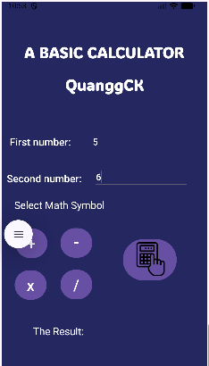

# BTAndroidPMQ65CLC
Welcome to my repository about Android Programming. At this repository, you can find all my examples in my code as well as the image of the app.

---

# 💻 Technology Used
* ☕ **Language:** Java  
* 🏗️ **IDE:** Android Studio  
* 📱 **SDK:** Android SDK 24+

---

# 📱 Assignments

## 👋 HelloWorld  
My first Android application that displays a Vietnamese greeting message when clicking a button.

---

## [🧩 ViduLayout1](VDLayout1/)  
This Android application helps us learn how to use the **ConstraintLayout** in Android development.

---

## [🧱 ViduLayout2](ViDuLayout2/)
This Android application demonstrates how to use the **LinearLayout** in both **horizontal** and **vertical** orientations.

---

## [🖱️ ViDuListener](ViDuListener/)  
This Android application demonstrates how to use **Listeners** in two ways (**Named listener** and **Anonymous listener**).

---

## [🎨 LoginFigmaScreen](LoginFigmaScreen/)
This assignment's goal is to replicate the original Figma and transform it in Android Studio.  
[🔗 Link Figma](https://www.figma.com/design/HO7EOnYSwiIhIhcT64MCoN/Untitled?node-id=18-1658&t=zMQZILJOb8NdonEO-1)

---

## [🙋‍♂️ About Me](AboutMe/)  
This assignment's goal is to replicate the original Figma and transform it in Android Studio.  
[🔗 Link Figma](https://www.figma.com/design/HO7EOnYSwiIhIhcT64MCoN/Untitled?node-id=18-1658&t=zMQZILJOb8NdonEO-1)

---

## [🧮 THGui_BasicCalculator](TH_BasicGUI_Calculator/)
This Android application uses Listeners to respond to user input.  
It demonstrates how to handle button click events in a simple calculator interface, allowing users to perform 
basic arithmetic operations such as addition, subtraction, multiplication, and division.

| Input  | Result |
|--------------|--------|
|  |  |

---

## [⚖️ THGUI_BasicBMI](lamthem_THBasicGUI_TinhBMI/)
This Android application lets users calculate their own BMI (body mass index).  
It includes a CheckBox option for Asian standards, using different reference numbers for evaluation.

| Input  | Result |
|--------------|--------|
|  |  |

---

## [🃏 CardInfo](lamthem_cardInfo/)  
This assignment was created to represent myself, inspired by **DbYugiCardSearch** and **Yugipedia**.

| Result |
|--------|
|  |

---

## [🎲 TracNghiemRandom](lamthem_tracnghiem1cau/)
This Android application helps me practice using **Random**.  
Its purpose is to generate random quiz questions for users to answer and get familiar with event handling in Android.

| Input  | Result |
|--------------|--------|
|  |  |

---

## [💱 UnitConverter](UnitConverter/)
This Android application helps me practice using **Listeners** and **Toast messages**.  
Its purpose is to convert USD to VND by handling a **Named Listener**.

| Input | Result |
|--------------|--------|
|  |  |

---

## [✊ BaoBuaKeo](lamthem_baobuakeo/)
This Android application helps me practice using **Listeners** and **Random**.  
Its purpose is to create a simple "Rock–Paper–Scissors" game where the player competes with the computer.  
**⚠️ WARNING:** You cannot see the computer play what, all you can see is the **"Bạn Thắng"** or **"Máy Thắng"**.

| Input | Result |
|--------------|--------|
|  |  |

---

## [♻️ RecyclerView1_Adapter](RecylerView1_Adapter/)
This Android application helps me learn how to use the **RecyclerView** component and create a custom **Adapter** to display data efficiently.  
Its purpose is to show images and captions of some well-known places, allowing users to scroll vertically through the list using **RecyclerView**.  
It also show us how to practice by testing how **LinearLayoutHoriziontal**, **LinearLayoutVertical(this is the standard when using Linear Layout)** and **GridLayout**.  
*💡 P/S:* Due to some issues with my Android Studio, I couldn’t run the app properly — sorry for the inconvenience.

---
## [QLDAFormula](lamthem_qldapm/)
I make this Android app to help me to rememeber some of the formular in the subject **"Project Management"** taught by Ms. Hằng in NTU.
I make this by using **RecyclerView**, **ViewPaper2**....
***Note: I still not finish this assignments.***

